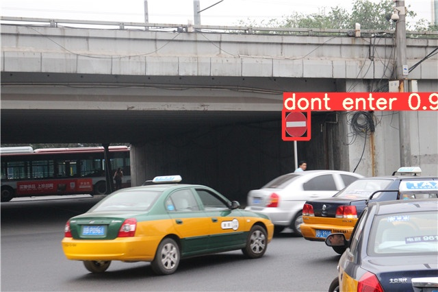
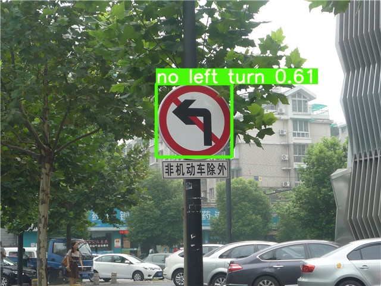
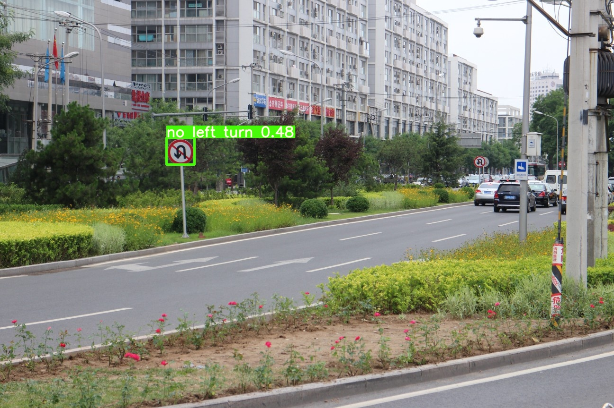
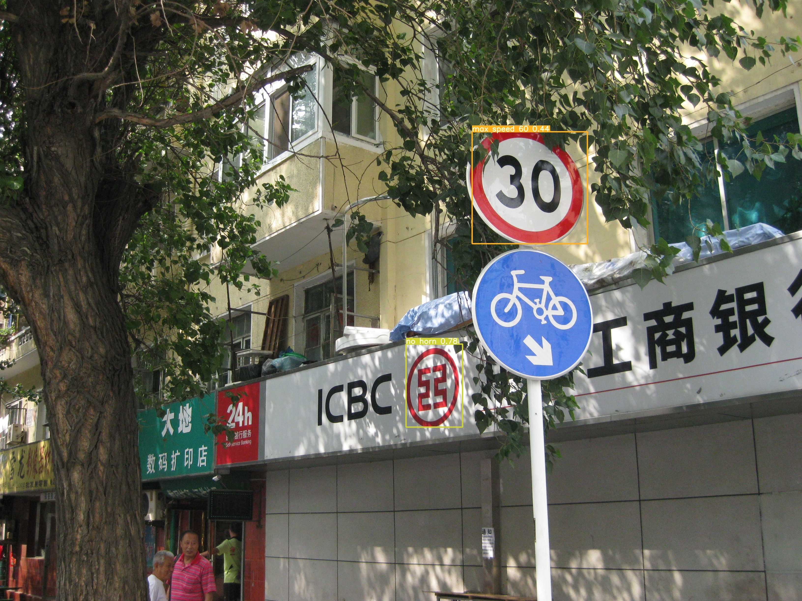

# Traffic Sign Detector

Traffic Sign Detector has implemented using Python and YOLOv5 library. The used dataset includes 1,325 pictures which have been collected and annotated by me and my friends.

This project can detect all of the following signs:

- Do Not Enter
- Keep Right
- Max Speed 40
- Max Speed 60
- No Horn
- No Left Turn
- Keep Straight
- No Right Turn
- No U Turn
- Parking
- Bicycle
- Stopping and Parking is prohibited

It should be mentioned that labelImg software used to annotate pictures.

Sample outputs produced by the code:

-   
